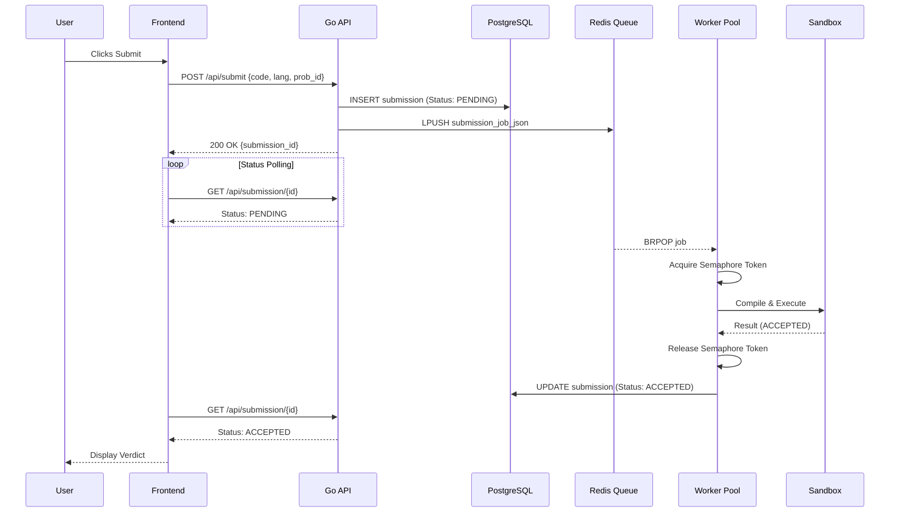
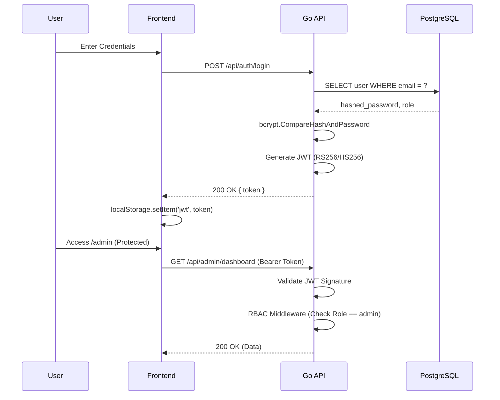

# 02 - System Architecture

## Overall Architecture

NicheCP employs a **Client-Server, Asynchronous Event-Driven Architecture**. The frontend acts as a thin client that consumes REST APIs. Heavy computation (compilation and execution of untrusted code) is completely decoupled from the HTTP request/response cycle using a Redis-backed Worker Pool pattern.

### System Components
1. **Frontend (Vanilla JS):** Handles presentation, JWT storage, and HTTP polling.
2. **Go API (Gin):** Handles authentication, RBAC, database CRUD operations, and enqueues jobs to Redis.
3. **PostgreSQL:** Persistent storage for user data, problems, and submission verdicts.
4. **Redis:** Fast in-memory data structure store used for the job queue (`submissions_queue`) and the global execution semaphore (`nichecp:execution_semaphore`).
5. **Worker Daemon:** Independent Go process(es) that consume jobs, acquire semaphore tokens, and execute code.
6. **SandboxProvider:** Interface abstraction that currently maps to `DockerSandbox` (and will map to `NsJailSandbox` in the future) to isolate execution.

## Request Lifecycle

### Code Submission Lifecycle



### Authentication Lifecycle



## Docker Architecture (Sandbox)
The current isolation mechanism relies on ephemeral Docker containers.
- **Image:** `alpine:latest` for statically compiled languages (Go, C++), `python:3.9-alpine` for Python, `eclipse-temurin:17-alpine` for Java.
- **Constraints:** `docker run --rm --network none --memory 256m --cpus 1.0 --pids-limit 50 --read-only`
- **Volume Mounts:** The compiled binary is mounted from a tmpfs RAM disk (`/dev/shm`) into the container as a read-only volume to prevent the process from overwriting itself or leaking data between testcases.

## Worker Architecture
The Worker Daemon (`cmd/worker/main.go`) operates independently from the main API.
- **Queueing:** Workers block on `redis.BRPop` awaiting payloads from the `submissions_queue`.
- **Bounded Concurrency:** A strictly sized pool (e.g., `MAX_EXECUTION_WORKERS = 4`) ensures that no matter how large the Redis backlog gets, the host VM is never overwhelmed with Docker containers.
- **Semaphore:** To prevent collisions with synchronous `/api/run` requests (IDE testing), workers must acquire a Redis ZSET token before execution.

## Deployment Architecture

```mermaid
graph TD
    Internet((Internet)) --> Nginx[Nginx Reverse Proxy :443]
    Nginx --> Static[/var/www/frontend]
    Nginx --> GoAPI[Go Systemd Service :8080]
    
    subgraph Host VM [Oracle Cloud Free Tier VM]
        GoAPI <--> PG[(PostgreSQL :5432)]
        GoAPI <--> Redis[(Redis :6379)]
        
        Worker[Go Worker Systemd Service] <--> PG
        Worker <--> Redis
        
        Worker --> Docker[Docker Daemon]
        Docker -.-> Container(Ephemeral Sandbox)
    end
```
