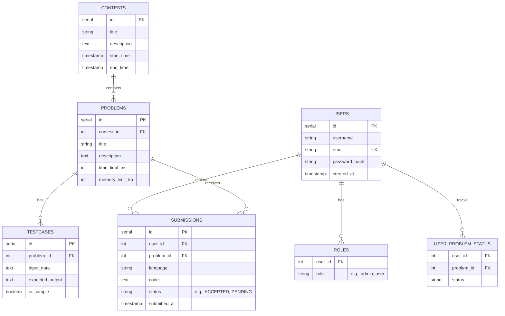

# 05 - Database Design

## Purpose
NicheCP relies on PostgreSQL for persistent, ACID-compliant data storage. The schema is designed to be highly relational, ensuring data integrity through foreign key constraints while remaining normalized to prevent data anomalies.

## Entity Relationship (ER) Diagram

## Tables & Design Decisions

### `users`
- Stores authentication credentials.
- `email` is enforced as `UNIQUE`.
- Passwords are securely hashed using `bcrypt` before insertion.

### `roles`
- Normalizes role assignments, allowing a single user to possess multiple roles (though currently constrained to 1-to-1 logically).
- Critical for the RBAC middleware. The superadmin (`dharunkaarthick07@gmail.com`) is bootstrapped automatically.

### `contests` & `problems`
- A standard 1-to-N relationship. Problems are tightly bound to a contest ID.

### `testcases`
- Stores inputs and exact expected outputs.
- `is_sample`: A boolean flag used to determine if a testcase should be visible to the user on the problem description page, or hidden for execution only.

### `submissions`
- The most highly volatile table.
- **Indexes:** Requires heavy indexing on `(user_id, problem_id)` and `(status)` to ensure fast leaderboard aggregations and polling lookups.
- **Status Lifecycle:** `PENDING` -> `ACCEPTED` / `WRONG_ANSWER` / `TIME_LIMIT_EXCEEDED` / `RUNTIME_ERROR` / `COMPILATION_ERROR` / `INTERNAL_ERROR`.

### `user_problem_status`
- A materialized view/cache table. It uses `ON CONFLICT DO UPDATE` to track the absolute highest achievement a user has reached for a specific problem. Used to quickly color-code the problem list UI (green for solved).

## Migration Strategy
Currently, NicheCP uses a naive migration strategy: auto-executing `CREATE TABLE IF NOT EXISTS` commands inside `internal/db/db.go` upon backend startup.
- **Future Recommendation:** Transition to a formal migration framework (like `golang-migrate/migrate`) to handle complex schema changes, rollbacks, and versioning safely without downtime.

## Transaction Handling
The Go backend utilizes `db.DB.BeginTx` for critical operations (e.g., submitting a code payload and placing a job on the Redis queue). However, a true distributed transaction between Postgres and Redis does not exist.
- **Future Recommendation:** Implement the **Transactional Outbox Pattern** to guarantee message delivery to Redis even if the Go API crashes immediately after Postgres commits.
