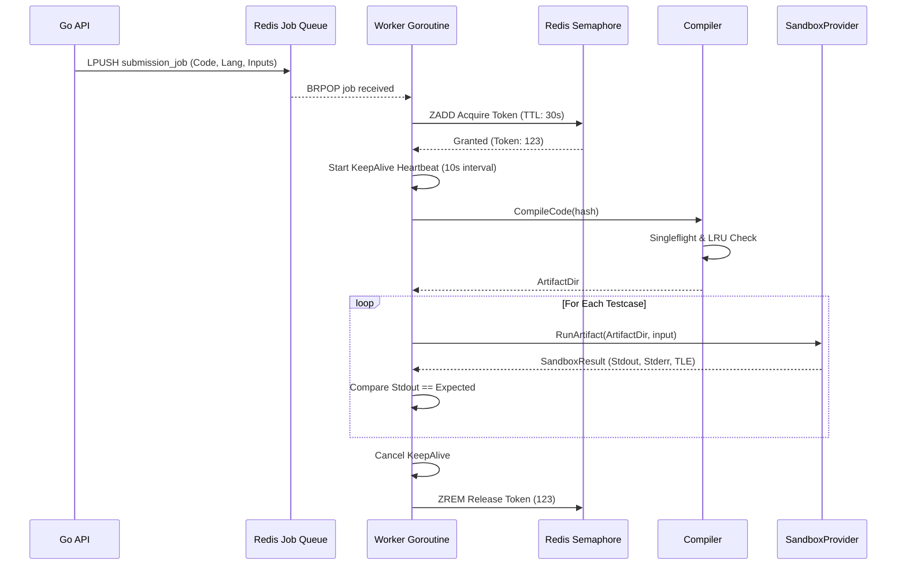

# 06 - Judge Architecture

## Purpose
The Judge Architecture (Execution Engine) is the crown jewel of NicheCP. It securely evaluates untrusted code in a highly concurrent, resource-constrained environment (2 OCPU / 12GB RAM) without stalling the main API server.

---

## Submission & Execution Flow

---

## Concurrency Model & Semaphores

### Problem: The Docker Explosion Risk
Executing code involves spawning Docker containers. If 200 users submit code simultaneously, a naive system will spawn 200 Docker containers, instantly causing the Oracle Cloud host to Out-Of-Memory (OOM) crash. 
Additionally, the `/api/run` endpoint (synchronous IDE testing) competes for the exact same Docker daemon resources as the background worker pool.

### Solution: Global Execution Semaphore
We restrict the absolute maximum number of concurrent sandbox executions across the entire host to **4**.

- **Implementation:** A distributed semaphore built using Redis Sorted Sets (`ZSET`).
- **Acquisition:** Before running a sandbox, the process calls `judge.AcquireExecutionToken`. A Lua script executes `ZREMRANGEBYSCORE` to evict expired tokens, checks `ZCARD`, and if `< 4`, adds a new UUID token with the current timestamp (`ZADD`).
- **Heartbeat & Crash Recovery:** The token has a baseline TTL of 30 seconds. Because 100 testcases might take longer than 30s to execute, the worker launches a `KeepAliveToken` goroutine that pings Redis every 10 seconds to renew the TTL. If a worker panics or crashes, the heartbeat dies, and the token expires gracefully, self-healing the capacity pool.

---

## Compiler Architecture

Compilation is incredibly expensive. NicheCP caches heavily to avoid redundant work.

### 1. LRU Binary Cache
Every compilation request is hashed: `SHA256(Code + Language + CompilerFlags)`.
- If the hash exists in the in-memory LRU cache (`github.com/hashicorp/golang-lru`), the compilation phase is entirely bypassed.
- **Eviction:** When the LRU cache hits capacity (500 binaries), an eviction callback is triggered that physically `os.RemoveAll`s the artifact from the RAM disk to free memory.

### 2. Singleflight Thundering Herd Protection
If 100 users submit the exact same solution exactly at the same time, the LRU cache is empty initially. `golang.org/x/sync/singleflight` guarantees that the compilation logic is executed **exactly once**, while the other 99 goroutines block and wait for the single result, massively conserving CPU.

### 3. Go Compilation Tmpfs Caching (`GOCACHE`)
By default, running `docker run golang go build` destroys the compiler's dependency cache when the container exits, resulting in 12-second compile times.
- NicheCP mounts a host tmpfs RAM disk `/dev/shm/nichecp-go-cache-v3` directly to `/cache/go-build` inside the ephemeral container.
- **Result:** Go compilation latency dropped from **~12.5s** down to **~2.3s** (and 79µs on LRU hits).

---

## Sandbox Architecture

### Current: `DockerSandbox`
To prevent malicious code from compromising the server, the process is heavily sandboxed.

| Constraint | Flag | Reason |
| :--- | :--- | :--- |
| **Network** | `--network none` | Prevents data exfiltration and DDoS attacks. |
| **Memory** | `--memory 256m` | Triggers OOM-killer if user code exceeds 256MB. |
| **CPU** | `--cpus 1.0` | Throttles runaway loops to 1 CPU core. |
| **PID Limit** | `--pids-limit 50` | Prevents fork bombs from crashing the host kernel. |
| **User** | `-u 1000:1000` | Drops root privileges. |
| **Privileges** | `--security-opt no-new-privileges` | Prevents `sudo` or setuid escalation. |
| **Filesystem** | `--read-only` | Prevents code from modifying the host or its own binary. |
| **Time Limit** | Go `context.WithTimeout` | Kills the Docker process exactly at 5.0s, returning TLE. |

### Future: `NsJailSandbox`
*Note: Currently fully abstracted but inactive pending host provisioning.*
Docker introduces ~350ms of daemon overhead per testcase. For 100 testcases, this means 35 seconds of pure virtualization delay.
NsJail bypasses the daemon entirely, executing code natively against kernel `cgroups v2` and namespaces, reducing startup latency to **~2ms**.

**NsJail Migration Requirements:**
1. Host compilation of `nsjail`.
2. Activation of unprivileged user namespace capabilities on the host.
3. Systemd-based delegation of `cgroup v2` access to the worker process to enforce memory/CPU limits without root.
